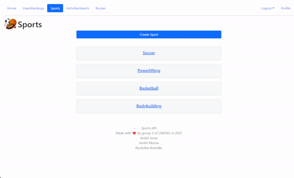
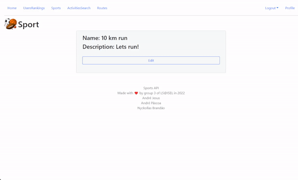
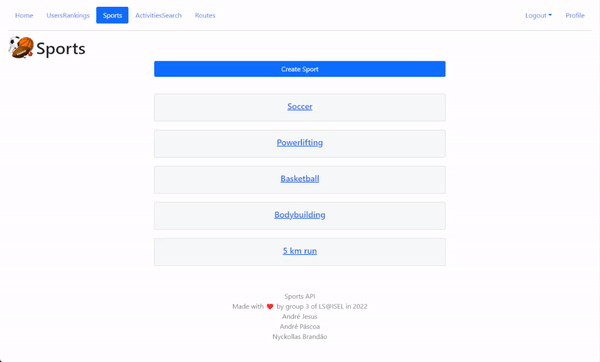
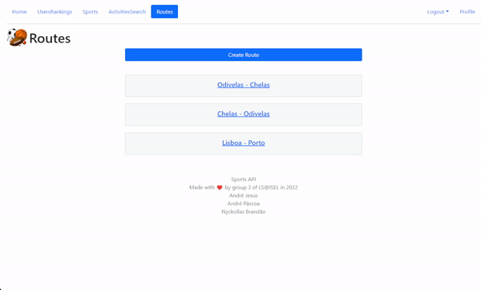
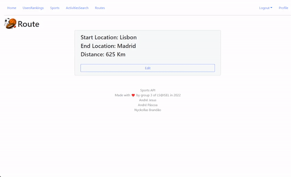
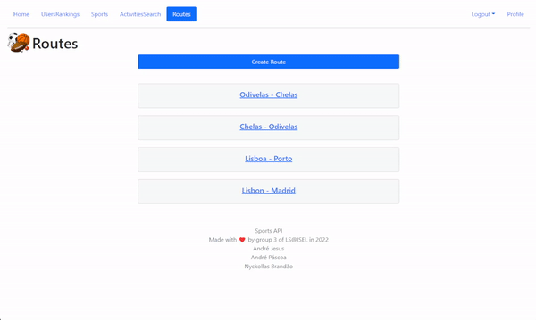
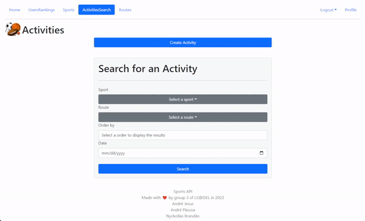
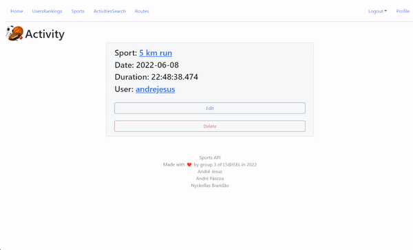

# 2122-2-LEIC41D-G03

> Software Laboratory project of group 03 from LEIC41D class.

> You can check the documentation of the project in the [wiki](https://github.com/isel-leic-ls/2122-2-LEIC41D-G03/wiki).

> The link for the deployed application is [here](https://isel-ls-2122-2-leic41d-g03.herokuapp.com/#).

The Sports API allows the user to perform creation and management of users, sports, routes and activities.
These operations can be performed via Web-UI (Website) or Web-API.

  

---

## Authors

- [André Páscoa](https://github.com/devandrepascoa)
- [André Jesus](https://github.com/Andre-J3sus)
- [Nyckollas Brandão](https://github.com/Nyckoka)

Professors: Engs. Filipe Freitas, Luís Falcão and Daniel Dias

ISEL 
Bachelor in Computer Science and Computer Engineering 
Software Laboratory - LEIC41D - Group 03 
Summer Semester of 2021/2022

---
---

## Available Operations

This section describes some operations that can be performed on the Sports API.
Creation, update and deletion operations can only be performed by the user who created the resource, so the user must be
authenticated.

A user can register to the Sports API by creating a new user, or signing in with an existing user.

To learn more about the API operations, please refer to
the
[API documentation](https://github.com/isel-leic-ls/2122-2-LEIC41D-G03/blob/574f00333ae71cebfd74759226725bfb69bee372/docs/sports-api-spec.yml)
.

### Sport

A sport can be created, updated or deleted by the user who created the resource.
All users can list and see details of all sports.

#### Creation

A sport can be created, given a name and a description.

  

#### Update

A sport can be updated, changing one or more of its fields.

  

#### Search and Details

All sports can be listed and details of a specific sport can be seen by all users.

  

---

### Route

A route can be created, updated or deleted by the user who created the resource.
All users can list and see details of all routes.

#### Creation

A route can be created, given a start and end location, and a distance in kilometers.

  

#### Update

A route can be updated, changing one or more of its fields.

  

#### Search and Details

All routes can be listed and details of a specific route can be seen by all users.

  

---

### Activity

An activity can be created, updated or deleted by the user who created the resource.
All users can list and see details of all activities.

#### Creation

An activity can be created, given a sport, a route, a date and a duration in the format `HH:MM:SS.FFF`.

  

#### Update

An activity can be updated, changing one or more of its fields.

  

#### Search and Details

All activities can be listed and details of a specific activity can be seen by all users.
The activities can be filtered by sport, route and date, and can be sorted ascending or descending, by these
fields.

  

